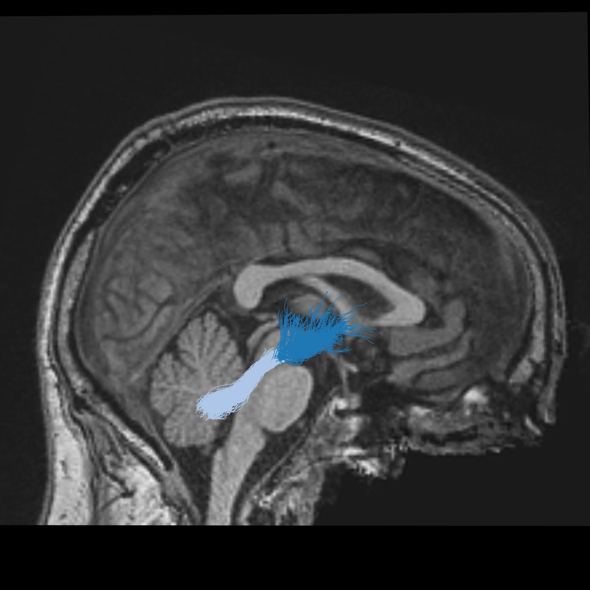
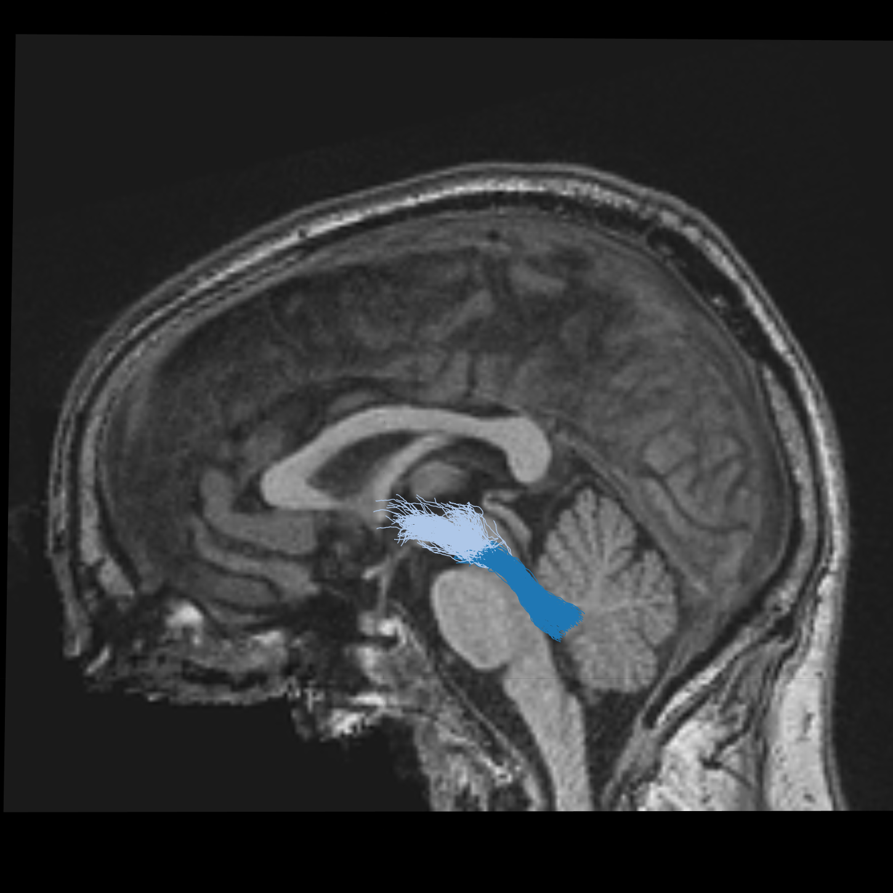
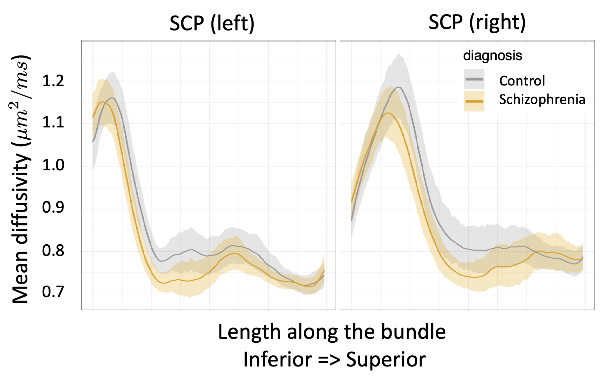

<style>
.poster_body h1 {
    font-family: "Palatino", "URW Palladio L", "serif";
}

body {
    bottom-margin: 0px;
}

.poster_body h1 {
    background-color: #b7a57a;
    border: #85754d;
}

h5 br {
    display: none;
}

.poster_title h3 {
    font-family: "Palatino", "URW Palladio L", "serif";
}

.poster_title h5 {
    font-family: "Palatino", "URW Palladio L", "serif";
    width: 120%;
    margin-left:-10%;
}

.title_container {
    height: 180mm; }

img[src*='#logo'] {
    width: 10%;
    height: 10%
}

</style>

```{r setup, include=FALSE}
knitr::opts_chunk$set(echo = FALSE)
```

# Background

- Schizophrenia (SZ) is a neurodevelopmental psychiatric disorder that carries significant health burden.
- The *cognitive dysmetria* theory of schizophrenia posits that the core cognitive deficits arise from dysfunctions of cortical-thalamic-cerebellar (CTC) circuits. [@Andreasen1998-gg]
- Previous research found increased functional connectivity in the cerebello-thalamo-cortical circuits in individuals at clinical high risk for psychosis. [@Cao2018]
- This hyperconnectivity was more pronounced in individuals who converted to psychosis, correlated to the severity of symptoms, and was predictive of the time to conversion.

<center>

![The cerebellum sends its output through the superior cerebellar peduncle (SCP), the contralateral red nucleus (RN), and VA/VL of the thalamus to various cerebral areas… The decussation (d) of the cerebero-thalamo-cortical pathway is indicated by the yellow circle. [@Palesi2015-oi]](images/palesi.jpg){width=60% height=60%}

</center>

**QUESTION**: Are the physical properties of the white matter tracts of the CTC different in individuals with SZ?   

\

# Methods

- **Data:** the UCLA Consortium for Neuropsychiatric Phenomics LA5c Study [@ds000030:1.0.0], which includes diffusion MRI (dMRI) data from 49 participants with SZ (mean age: 36.2 +/- 8.8 SD; 12 female), 40 participants with ADHD (mean age: 31.95 +/- 10.3 SD; 20 female), 49 participants with bipolar disorder (BD) (mean age: 35.3 +/- 9.0 SD, 21 female), and 123 controls (CTRL) (mean age: 31.6 +/- 8.8 SD; 58 female).
- The data were processed using QSIPREP [@Cieslak2021-vj] and pyAFQ [@Kruper2021-az] [@Yeatman2012-ze]
- The SCPs were identified in each individual using pyAFQ and anatomical criteria that capture the decussation of these bundles. [@Jossinger2023-gj]
- This resulted in tract profiles of fractional anisotropy (FA) and mean diffusivity (MD) in each white matter pathway (100 nodes each). 
- We then fit generalized additive models (GAMs) for FA and MD in each bundle as a function of diagnosis (entered as a factor: SZ or CTRL), nodeID (modeled with an adaptive smooth, where degree of the smooth is determined as the k that minimizes the AIC), age, sex (entered as a factor) and data quality (quantified as the neighbor correlation from QSIPREP). [@Muncy2022GAMs]

{width=24% height=24%}
{width=24% height=24%} 
{width=24% height=24%} 
{width=24% height=24%}
<div style="font-size:32px; font-family:'Palatino'; text-align:center">The left (dark blue) and right (light blue) SCP bundles visualized in an individual with SZ, with sagittal, coronal and axial anatomical views of the T1-weighted scan of this individual.</div>

\
\
\

# Results

{width=100% height=100%}

- MD differed significantly in the left superior cerebellar peduncle (SCP) between the SZ and CTRL groups (p<0.05), but not between the ADHD and CTRL groups or BD and CTRL groups. 
- Individuals with SZ had lower MD in this tract than the matched controls. 
- This finding held after adding medication as a covariate (haloperidol equivalent dosage). 
- No other significant differences were found.

\

# Conclusions

- We found decreased MD in the left SCP, a component of the CTC. 
- Lower MD may indicated increased myelination and therefore increased connectivity. 
- Increased density and directional coherence (but not axonal diameter) may also have similar effects on MD. 
- These results appear in line with previous fMRI results that found increased functional connectivity in the CTC in individuals with SZ. [@Cao2018]
- This provides additional support for the cognitive dysmetria theory of SZ. 

\

# Acknowledgements

NIMH grants: MH121867 (PI: Poldrack), MH121868 (PI: Rokem), EB027585 (PI: Garyfallidis)

\

# References
