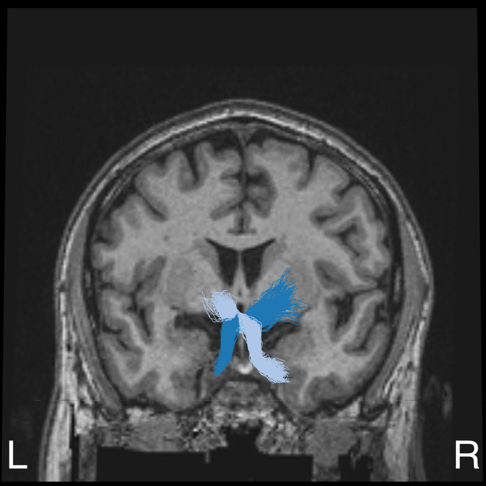
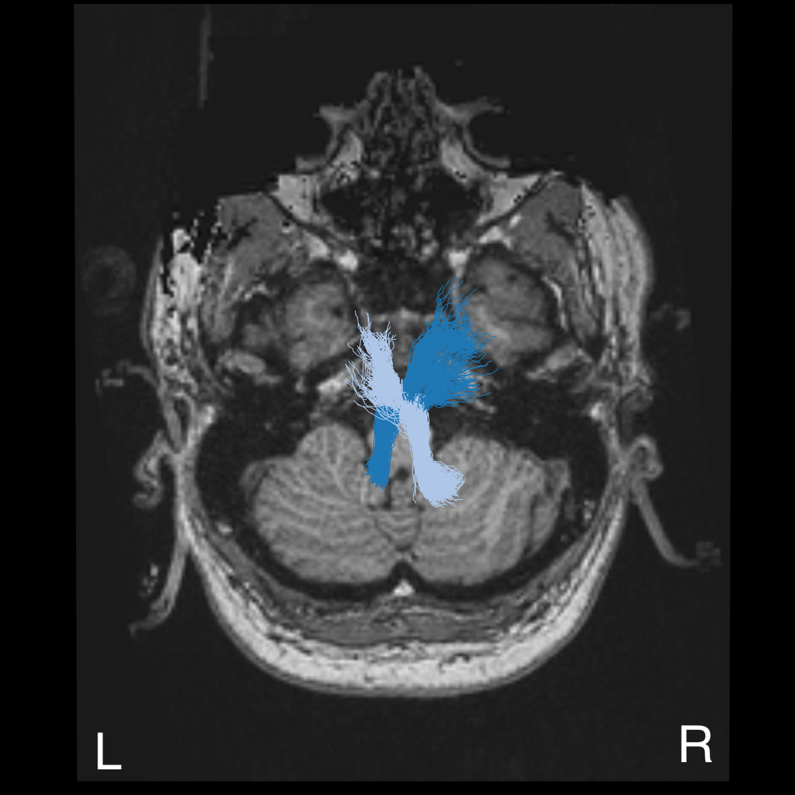
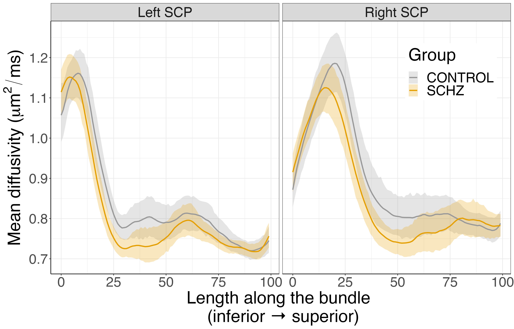
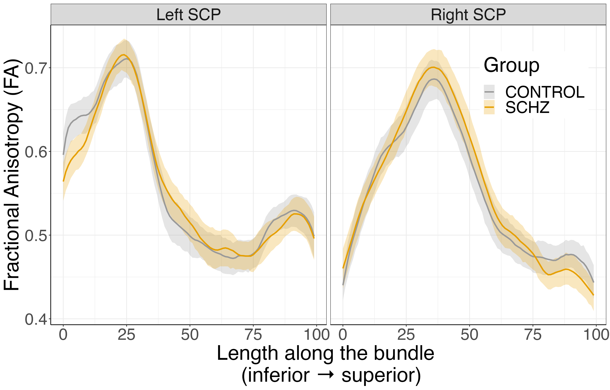
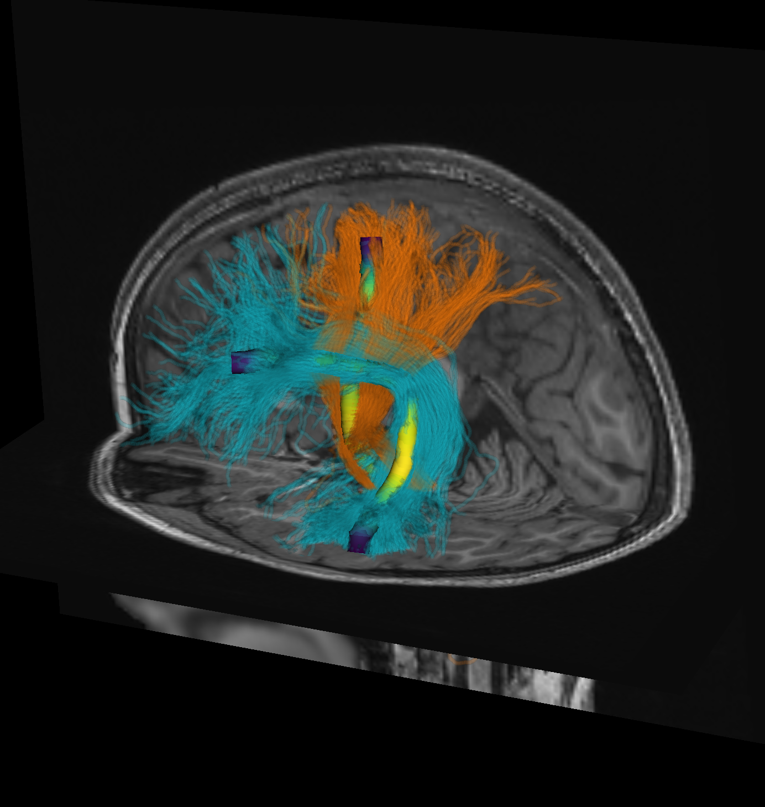
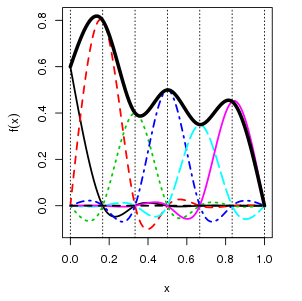

<style>
.poster_body h1 {
    font-family: "Helvetica";
}

body {
    bottom-margin: 0px;
}

.poster_body h1 {
    background-color: #b7a57a;
    border: #85754d;
}

h5 br {
    display: none;
}

.poster_title h3 {
    font-family: "Helvetica";
}

.poster_title h5 {
    font-family: "Helvetica";
    width: 120%;
    margin-left:-10%;
}

.title_container {
    height: 150mm; }

img[src*='#logo'] {
    width: 10%;
    height: 10%
}

.mybreak {
   break-before: column;
}

</style>

```{r setup, include=FALSE}
knitr::opts_chunk$set(echo = FALSE)
```

{height=200 style="position: absolute; top: 50px; left: 50px;"}
{height=150 style="position: absolute; top: 150px; left: 2920px;"}
{height=150 style="position: absolute; top: -50px; left: 2900px;"}


{height=200 style="position: absolute; top: 3800px; left: 2900px;"}


# Background

- Schizophrenia (SZ) is a neurodevelopmental psychiatric disorder that carries significant health burden.
- The *cognitive dysmetria* theory of schizophrenia posits that the core cognitive deficits arise from dysfunctions of cortical-thalamic-cerebellar (CTC) circuits. [@Andreasen1998-gg]
- Previous research found increased functional connectivity in the cerebello-thalamo-cortical circuits in individuals at clinical high risk for psychosis. [@Cao2018]
- This hyperconnectivity was more pronounced in individuals who converted to psychosis, correlated to the severity of symptoms, and was predictive of the time to conversion.
-  The cerebellum sends its output through the superior cerebellar peduncle (SCP), the contralateral red nucleus (RN), and VA/VL of the thalamus to various cerebral areas. The decussation (d) of the cerebero-thalamo-cortical pathway is indicated by the yellow circle (image taken from [@Palesi2015-oi]).

<center>
{width=60% height=60%}
</center>

**QUESTION**: Are the physical properties of the white matter tracts of the CTC different in individuals with SZ?

# Methods
<p style="margin-bottom:-1cm">
**Data:**
</p>

- Diffusion MRI data (64 directions, b=1,000 $s/mm^2$) from the UCLA Consortium for Neuropsychiatric Phenomics LA5c study (Open Neuro DS00030).
- Participants: SZ (N=12F/37M, age: 36.2 $\pm$ 8.8 SD), ADHD (N=20F/20M F/M age: 31.95 $\pm$ 10.3), bipolar disorder (BD; N=21F/28M, age: 35.3 $\pm$ 9.0), Healthy control (HC 58F/65M, age: 31.6 $\pm$ 8.8).

<p style="margin-bottom:-1cm">
**Processing**:
</p>

- QSIPREP [@Cieslak2021-vj] and pyAFQ [@Kruper2021-az] for preprocessing, QC, and tractometry (FA/MD tract profiles).
- Bilateral SCP were identified in each individual using anatomical criteria that capture the decussation [@Jossinger2023-gj].
- Group-blinded QC of SCP bundle was conducted by two expert observers (TG and AR).

<p style="margin-bottom:-1cm">
**Analysis**:
</p>

- Data quality confounds were mitigated by matching each SZ/ADHD/BD to a HC with similar age, sex and data quality (neighbor correlations, NDC).
- Generalized additive models (GAMs) for FA and MD in each SCP as [@Muncy2022GAMs]:
<p style="font-family:'Lucida Console', monospace">
  FA/MD ~ group + s(nodeID, k, by=group) + \n age + sex + QC + s(subjectID, bs="re")
</p>
with k chosen to minimize AIC and neighbor correlations [@Yeh2019NDC] for QC.

# Acknowledgements
<div style="font-size:36px">
NIH grants: MH121867 (PI: Poldrack), MH121868 (PI: Rokem, EB027585 (PI: Garyfallidis)
</div>

# Results{.mybreak}

{width=24% height=24%}
{width=24% height=24%}
{width=24% height=24%}
{width=24% height=24%}
<div style="font-size:32px; font-family:'Palatino'; text-align:center">The left (dark blue) and right (light blue) SCP bundles visualized in an individual with SZ, with sagittal, coronal and axial anatomical views of the T1-weighted scan of this individual.</div>

<center>
{width=49% height=49%}
{width=49% height=49%}
</center>
<div style="font-size:32px; font-family:'Palatino'; text-align:center">Tract profiles of MD (left) and FA (right) $\pm$ bootstrapped 95% confidence interval</div>

- MD differed significantly in the left superior cerebellar peduncle (SCP) between the SZ and HC groups (p<0.05), but not between the ADHD and HC groups or BD and HC groups.
- Individuals with SZ had lower MD in this tract than the matched controls (as indicated).
- This finding held after adding medication as a covariate (haloperidol equivalent dosage).

# Conclusions

- We found decreased MD in SZ in the left SCP, a component of the CTC.
- In line with fMRI results that found increased functional connectivity in CTC in SZ. [@Cao2018]
- Provides additional support for the cognitive dysmetria theory of SZ.


# Software

{height=260 style="position: absolute; top: 2875px; left: 1800px;"}
{height=260 style="position: absolute; top: 3200px; left: 1800px;"}

<p style="margin-bottom:8cm">
**pyAFQ**: Automated Fiber Quantification / tractometry
</p>

{height=300 style="position: absolute; top: 2875px; left: 2750px;"}

<p style="margin-bottom:8cm">
**Tractable**: Statistical analysis tract profiles in R
</p>
{height=320 style="position: absolute; top: 3200px; left: 2700px;"}

# References

